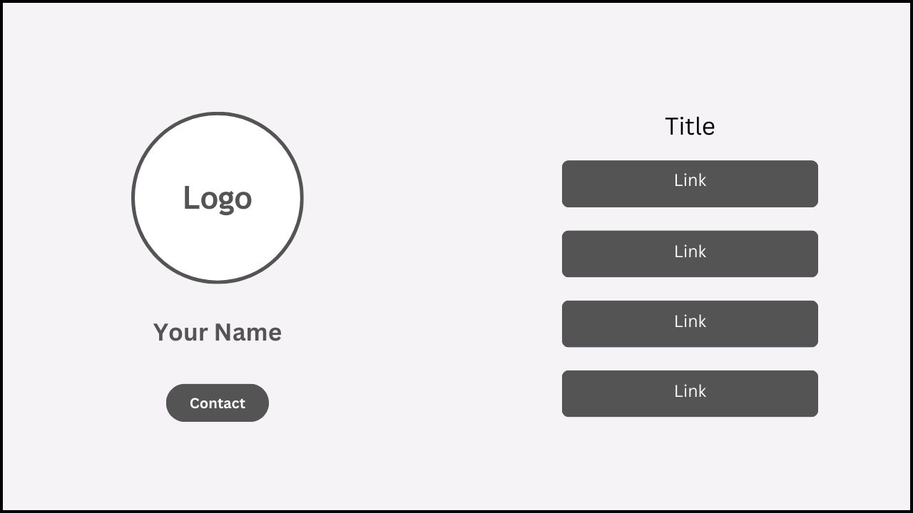

<h1>Link in Bio Project</h1>

Welcome to the <b><a href="https://askaf11.github.io/Link-in-Bio/" target="_blank">Link in Bio Project!</a></b> This project is inspired by Linktree, aiming to create a simple, customizable, and efficient way for users to share multiple links from a single URL in their social media bios.

<h2>Introduction</h2>

The <b><a href="https://askaf11.github.io/Link-in-Bio/" target="_blank">Link in Bio Project</a></b> allows you to create a landing page that contains multiple links. This is particularly useful for social media profiles where you are limited to a single URL in your bio. With this project, you can link to all your important content from one place.

<h2>Features</h2>
<ul>
<li>Customizable Layout: Personalize the look and feel to match your brand.</li>
<li>Multiple Links: Add as many links as you need.</li>
<li>Analytics: Track link clicks and performance.</li>
<li>Responsive Design: Looks great on both desktop and mobile devices.</li>
<li>Easy to Use: Simple interface for adding and managing links</li>
</ul>
  
<h4 align="center">Link in Bio Project | Created by <a href="https://askaf.in/" target="_blank">Askaf</a></h4>
